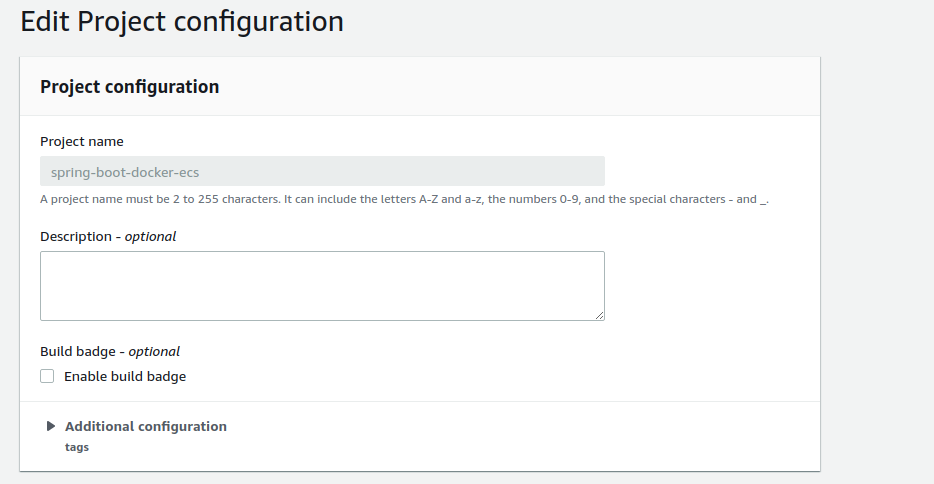
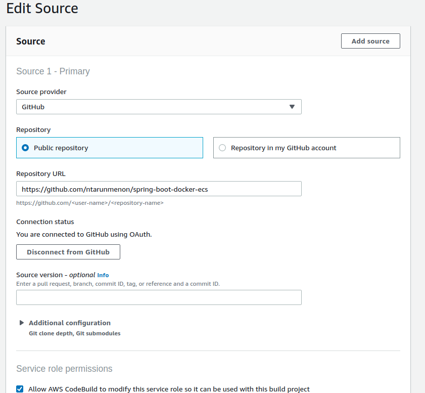
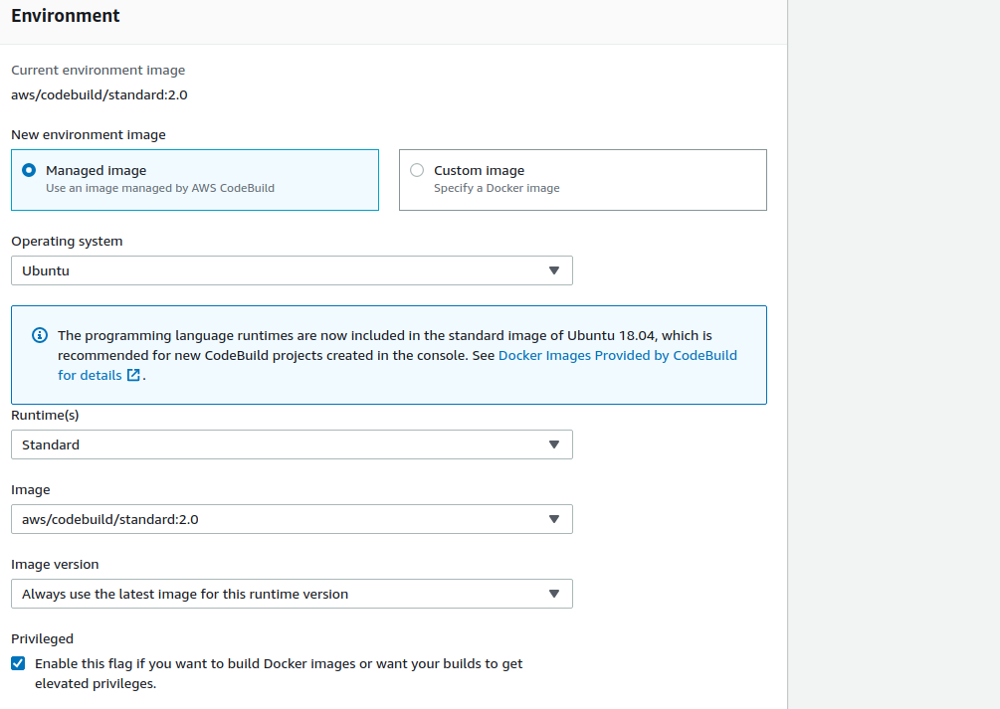
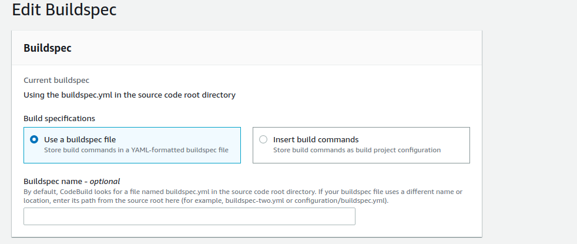
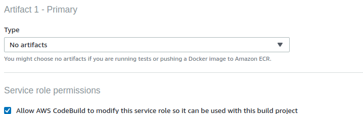
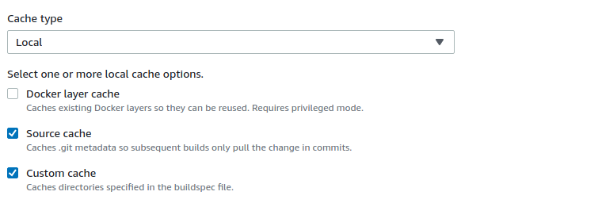
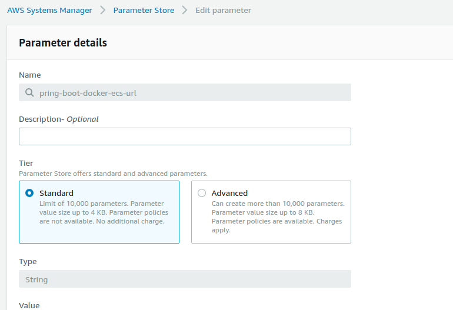

# spring-boot-docker-ecs
spring-boot-docker-ecs

## Objective

The objective is to Create a Spring Boot project which is CICD enabled. Whenever a change is pushed to Github there should be a AWS CodeBuild
project which will fetch the changes from Codebuild and then deploy the changes to ECS.

The text below will show how this can be done organically 1.e start with a simple project running in local, then use code build to push the changes to 
ECR repo etc. The sequence below elaborates further

- Create a simple Spring Boot API & Dockerize it. 
- Use AWS CodeBuild build to push the image to docker in ECR. 
- Deploy this application to an EC2 instance and test using CURL
- Create a code pipeline project which will fetch start codebuild and deploy to an already existing EC2 instance.  
- Use code pipeline and code deploy to deploy the application to ECS. 


### Create a simple Spring Boot API & Dockerize it

```groovy
 ./mvnw install dockerfile:build dockerfile:push -Ddocker-image-ecr-repo=#Your-ECR-Repo-here#
 docker run -p 8080:8080 -t springio/spring-boot-docker-ecs

```

Run `http://localhost:8080/` and verify that `Hello Docker World` is being shown.

### Use AWS CodeBuild build to push the image to docker in ECR. 


##### The easy way

To be done:- Write cloudformation to create the CodeBuild project

##### The hard way

1. Set up a code build project as per the following screen shots.

###### Project Configuration



###### Source Configuration



###### Environment Configuration



###### Buildspec Configuration




###### Artifacts Configuration





2. Code build will create a IAM role for you. Modify the IAM role with the following.

- Replace  #your-account-no" with your account number
- Replace #your-region-code# with your region code (ap-southeast-2)

```
{
    "Version": "2012-10-17",
    "Statement": [
        {
            "Effect": "Allow",
            "Resource": [
                "arn:aws:logs:#your-region-code#":#your-account-no":log-group:/aws/codebuild/spring-boot-docker-ecs",
                "arn:aws:logs:#your-region-code#":#your-account-no":log-group:/aws/codebuild/spring-boot-docker-ecs:*"
            ],
            "Action": [
                "logs:CreateLogGroup",
                "logs:CreateLogStream",
                "logs:PutLogEvents"
            ]
        },
        {
            "Effect": "Allow",
            "Resource": [
                "arn:aws:s3:::codepipeline-#your-region-code#"-*"
            ],
            "Action": [
                "s3:PutObject",
                "s3:GetObject",
                "s3:GetObjectVersion",
                "s3:GetBucketAcl",
                "s3:GetBucketLocation"
            ]
        },
        {
            "Sid": "ssmStore",
            "Effect": "Allow",
            "Action": "ssm:GetParameters",
            "Resource": [
                "arn:aws:ssm:#your-region-code#":#your-account-no":parameter/pring-boot-docker-ecs-url"
            ]
        },
        {
            "Sid": "GetAuthorizationToken",
            "Effect": "Allow",
            "Action": "ecr:GetAuthorizationToken",
            "Resource": [
                "*"
            ]
        },
        {
            "Sid": "AllowCrossAccountPush",
            "Effect": "Allow",
            "Action": [
                "ecr:GetDownloadUrlForLayer",
                "ecr:BatchCheckLayerAvailability",
                "ecr:PutImage",
                "ecr:InitiateLayerUpload",
                "ecr:UploadLayerPart",
                "ecr:CompleteLayerUpload"
            ],
            "Resource": [
                "*"
            ]
        }
    ]
}

```

3. Create an ECR repository to store the docker build. The name of the ECR repository should be `spring-boot-docker-ecs`

4. Create an SSM parameter store which will point to your ecs store.



5. Refer [buildspec.yml](buildspec.yml) for understanding how code build is configured.

```
version: 0.2
env:
  parameter-store:
    spring_boot_docker_ecs_url: "pring-boot-docker-ecs-url"
phases:
  install:
    runtime-versions:
      java: openjdk11
      docker: 18
    commands:
      - echo install step...
  pre_build:
    commands:
      - echo logging in to AWS ECR...
      - $(aws ecr get-login --no-include-email --region ap-southeast-2)
  build:
    commands:
      - export MAVEN_CONFIG=''
      - echo build Docker image on `date`
      - ./mvnw install dockerfile:build dockerfile:push -Ddocker-image-ecr-repo=$spring_boot_docker_ecs_url
cache:
  paths:
    - '/root/.m2/**/*'

```


6. Key Gotchas

- `export MAVEN_CONFIG=` is added in buildspec.yml to bypass an existing [issue](https://github.com/aws/aws-codebuild-docker-images/issues/237) in code build docker.
- SSM parameter store is introduced so that you never keep your account number in github. 
- It is important to modify the default roles created by code build so that the build can pull and push images from and to ECR.
- It is important to enable `Priveleged` [flag](images/code-03.png) here when creating the build. This flag is mandatory so that the build process gets access to Docker.


7. Issues to solve

- Build cache is not working for some reason. 

### Deploy this application to an EC2 instance and test using CURL

1. Create an ubuntu instance in EC2 console.
2. SSH into the instance.
3. Execute the following set of commands

```

sudo snap install docker
sudo groupadd docker
sudo usermod -aG docker $USER
sudo snap restart docker
sudo snap install aws-cli --classic

```

4. Create an policy as follows in IAM 

```
{
    "Version": "2012-10-17",
    "Statement": [
        {
            "Sid": "VisualEditor0",
            "Effect": "Allow",
            "Action": [
                "ecr:GetDownloadUrlForLayer",
                "ecr:BatchGetImage",
                "ecr:BatchCheckLayerAvailability"
            ],
            "Resource": "*"
        },
        {
            "Sid": "GrantECRAuthAccess",
            "Effect": "Allow",
            "Action": "ecr:GetAuthorizationToken",
            "Resource": "*"
        }
    ]
}
```
5. Attach the above role to the EC2 instance from console. 

6. Run the following set of commands to pull the ECR image from docker. 

```
 ## If the below command does not work then reload bash or log out and login again
 $(aws ecr get-login --no-include-email --region #your-region-code#")

## The below command will pull the image from docker
 docker pull #account_no#.dkr.ecr.#your-region-code#".amazonaws.com/springio/spring-boot-docker-ecs

## Get the image id and run it using the following commands

docker ps
docker run -p 8080:8080 -t #account_no#.dkr.ecr.#your-region-code#.amazonaws.com/spring-boot-docker-ecs

```

7. Edit the inbound rule associated with your security group to allow requests to 8080.

8. Test the command using the following command

```
curl ec2-3-104-105-220.#your-region-code#".compute.amazonaws.com:8080
```